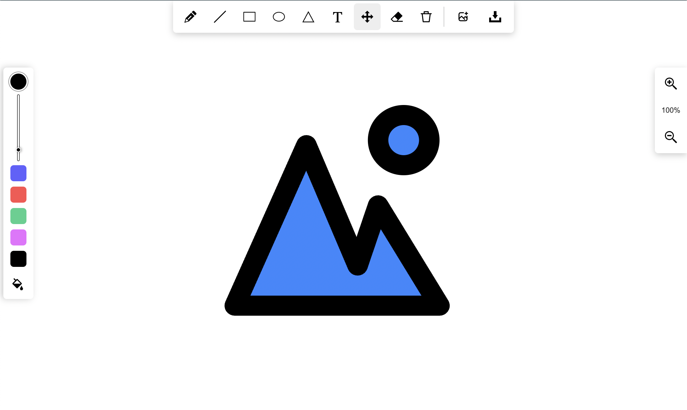

# react-whiteboard-pdf

<div>
  <h2>
    React virtual whiteboard with PDF and Images upload functionality
    <br />
  </h2>
</div>

<br />



Check App demo here:

# App [DEMO](https://statuesque-muffin-fb224e.netlify.app/)

<br/>

## If you like this project you can help us with any donation

github: [github.com/sponsors/spiridonov-oa](https://github.com/sponsors/spiridonov-oa)
patreon: [patreon.com/OlegSpiridonov](https://patreon.com/OlegSpiridonov)

## Compatibility

React 17+

<br/>

## Installation

```shell
npm install react-whiteboard-pdf
```

or

```shell
yarn add react-whiteboard-pdf
```

<br/>

## Usage

```javascript
const App = () => {
  return (
    <div>
      <Whiteboard />
    </div>
  );
};
```

### Advanced Usage with Props and Event Handlers

```javascript
import { Whiteboard } from 'react-whiteboard-pdf';

const App = () => {
  return (
    <Whiteboard
      // State management for tab, canvas, and pages
      state={{
        tabIndex: 0, // Current active tab index
        content: {
          // Canvas content information
          json: canvasJSON, // Canvas JSON data
          pageNumber: 0, // Current page number
        },
        tabsState: [], // Optional state for all tabs
        fileInfo: {}, // Optional file information
      }}
      // Active tab index
      activeTabIndex={0}
      // JSON string of canvas content
      contentJSON={JSON.stringify(canvasJSON)}
      // Drawing settings
      drawingSettings={{
        brushWidth: 5, // Brush size for drawing (default: 5)
        currentMode: 'PENCIL', // Drawing mode: PENCIL, LINE, RECTANGLE, etc.
        currentColor: '#000000', // Current drawing color
        fill: false, // If true, shapes will be filled with color
      }}
      // File information
      fileInfo={{
        fileName: 'Document', // Name of the current document
        totalPages: 1, // Total number of pages
        currentPageNumber: 0, // Current page number (0-based)
        currentPage: '', // Current page data
        pages: [], // Array of page data
      }}
      // UI Controls visibility
      controls={{
        PENCIL: true, // Pencil/freehand drawing tool
        LINE: true, // Line drawing tool
        RECTANGLE: true, // Rectangle drawing tool
        ELLIPSE: true, // Ellipse/circle drawing tool
        TRIANGLE: true, // Triangle drawing tool
        TEXT: true, // Text tool
        SELECT: true, // Selection tool
        ERASER: true, // Eraser tool
        CLEAR: true, // Clear canvas button
        FILL: true, // Fill toggle for shapes
        BRUSH: true, // Brush width control
        COLOR_PICKER: true, // Color picker
        DEFAULT_COLORS: true, // Default color palette
        FILES: true, // File upload button
        SAVE_AS_IMAGE: true, // Save as image button
        GO_TO_START: true, // Reset view button
        SAVE_AND_LOAD: true, // Save/load functionality
        ZOOM: true, // Zoom controls
        TABS: true, // Tab interface
      }}
      // Event handlers
      onFileAdded={(fileData) => {}} // When a file is added
      onTabStateChange={(state) => {}} // When tab state changes
      onObjectAdded={(data, event, canvas) => {}} // When object is added to canvas
      onObjectRemoved={(data, event, canvas) => {}} // When object is removed
      onObjectModified={(data, event, canvas) => {}} // When object is modified
      onCanvasRender={(state) => {}} // When canvas renders
      onCanvasChange={(state) => {}} // When canvas content changes
      onZoom={(data, event, canvas) => {}} // When zoom is changed
      onImageUploaded={(file, event, canvas) => {}} // When image is uploaded
      onPDFUploaded={(file, event, canvas) => {}} // When PDF is uploaded
      onPDFUpdated={(fileInfo, event, canvas) => {}} // When PDF is updated
      onPageChange={(state) => {}} // When page is changed
      onOptionsChange={(options, state) => {}} // When drawing options change
      onSaveCanvasAsImage={(blob, event, canvas) => {}} // When canvas saved as image
      onConfigChange={(settings, event, canvas) => {}} // When config is changed
      onDocumentChanged={(fileInfo, state) => {}} // When document changes
    />
  );
};
```

## WhiteboardState Object Structure

The state object returned by many of the event handlers has the following structure:

```javascript
{
  content: {
    tabIndex: number,    // Current active tab index
    pageNumber: number,  // Current page number
    json: object         // Canvas JSON data
  },
  pageNumber: number,    // Current page number
  tabIndex: number,      // Current active tab
  newTabIndex?: number,  // New tab index if tab was changed
  page: {                // Current page information
    pageNumber: number,
    pageData: {
      contentJSON: string,        // JSON string of content
      zoom: number,               // Current zoom level
      viewportTransform: number[] // Canvas viewportTransform array
    }
  },
  tabsState: Map<number, TabState> // Map of all tabs' states
}
```

## Drawing Modes

Available drawing modes in the Whiteboard component:

```javascript
const modes = {
  PENCIL: 'PENCIL', // Freehand pencil drawing
  LINE: 'LINE', // Line drawing
  RECTANGLE: 'RECTANGLE', // Rectangle shape
  ELLIPSE: 'ELLIPSE', // Ellipse/circle shape
  TRIANGLE: 'TRIANGLE', // Triangle shape
  TEXT: 'TEXT', // Text tool
  SELECT: 'SELECT', // Selection tool
  ERASER: 'ERASER', // Eraser tool
};
```

## Multi-Document Support

The Whiteboard component supports multiple documents through the tabs interface. Each tab can have:

- Different content
- Multiple pages (for PDFs)
- Independent drawing settings
- Separate zoom and view settings

## Development:

```shell
npm i
npm start
```

## Author:

[spiridonov-oa](https://github.com/spiridonov-oa)

## Contributors:

Thanks for your help in building this project
[rodionspi](https://github.com/rodionspi)
